# WebHUD

**Smart glasses without the vendor OS — a web page, your agent, any glass.**

**Entry for the [OpenAI WebMCP Challenge](https://webmcp.devpost.com/).**

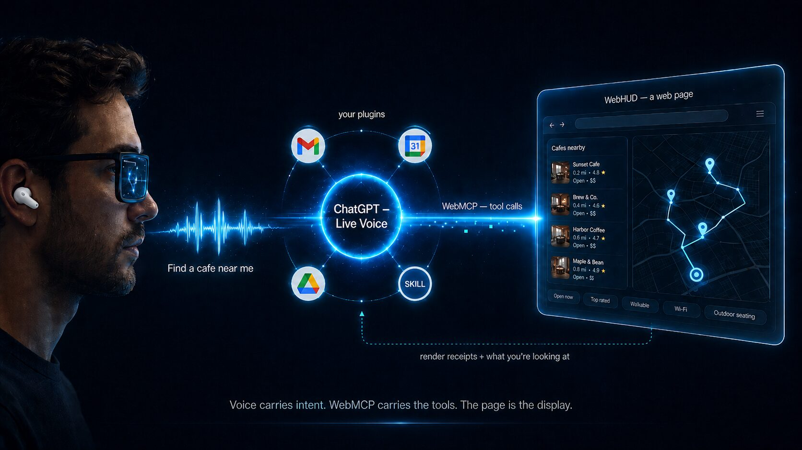

Today's smart glasses ship the vendor's OS, the vendor's assistant, and the vendor's app store — an assistant that doesn't know you, can't reach your tools, and locks your data to one brand of frame. WebHUD argues the display should be the dumbest part of the stack: **the glasses are just a projector, the interface is a web page, and the brain is the agent you already use** — with your memory, your connectors, your preferences.

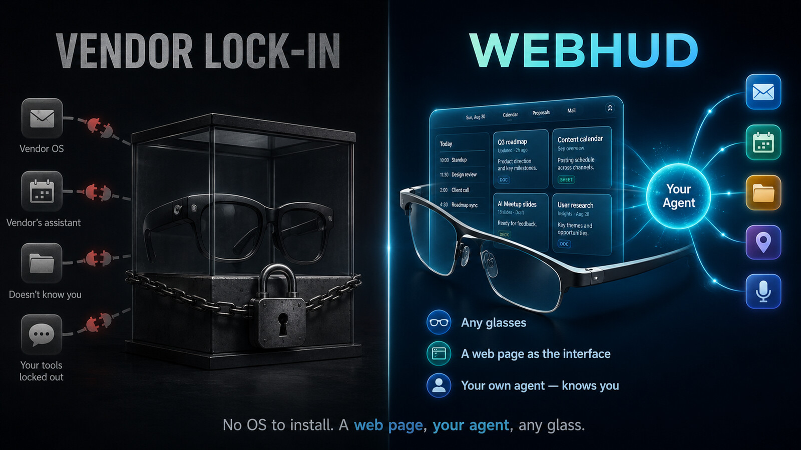

Your agent (ChatGPT in its in-app browser, or any WebMCP-capable agent) pulls your real data through its own connectors — Gmail, Google Calendar, Google Drive, web search — and renders it onto a full-screen heads-up surface that you drive from two metres away with **voice, a palm swipe, or a $4 Bluetooth ring**. The page adapts what it renders to the context: the same tool call becomes a comparison table on a desktop and swipeable cards inside a smart-glasses lens.

**The thesis:** responsive design adapted *layout* to screens. WebHUD's smart-responsive contract adapts *interaction and presentation* to context — and WebMCP is the channel where the agent's knowledge meets the human's physical attention.

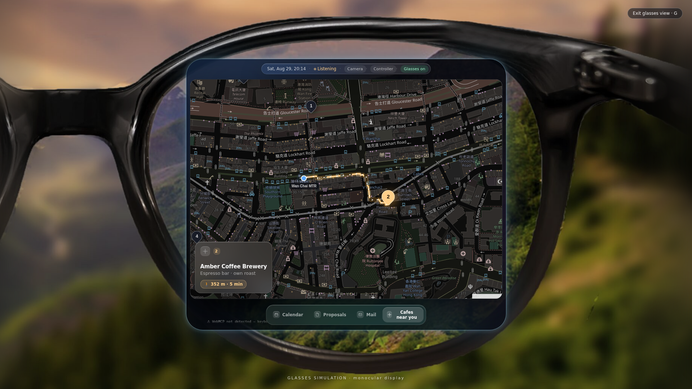

**Live demo:** <https://webhud.shekkawai.workers.dev>

## Try it in 60 seconds (judges)

1. Open the live URL in the latest **ChatGPT desktop app** using **GPT-5.6 Sol or Terra**, or use **Chrome 149+** with `chrome://flags/#enable-webmcp-testing` enabled.
2. Ask the agent things like:
   - *"Show my latest emails on the surface"* (uses your connectors), or
   - *"Find three venues for an annual dinner and compare them"*, then *"I'm at SF Caltrain — find a cafe nearby"* → *"take me to the second one"* (the page draws and animates the real walking route, and hands the agent the distance and street names to speak).
3. No camera or ring needed: **← → arrow keys mirror the palm swipe 1:1**, ↓ enters the dock (D-pad style), **G** toggles the smart-glasses simulation.
4. No agent handy? Seeded demo states work in any browser:
   `?demo=mail | calendar | month | reader | compare | slots | options | people | cafes | route` — and add `&glasses=1` for the lens view.

## How WebMCP is implemented

Every capability is a page tool registered through **`document.modelContext.registerTool`** (with the `navigator.modelContext` fallback for earlier builds of the API):

```js
document.modelContext.registerTool({
  name: "surface_present",
  description: "Render data for the user. Say what the user needs to DO with it " +
    "(glance / browse / inspect / compare / choose / triage); the page picks the " +
    "component for the current context (desktop vs glasses lens).",
  inputSchema: { /* JSON Schema — each purpose value teaches itself with a definition + example */ },
  execute: async (input) => {
    /* render into the live surface, then return a render receipt:
       { rendered: "comparison-table", context: "desktop", showing: 3, of: 3 } */
  },
});
```

The implementation lives in [`src/webmcp/adapter.ts`](src/webmcp/adapter.ts) (registration lifecycle) and [`src/tools.ts`](src/tools.ts) (the tool surface). The parts that go beyond a static tool list:

- **Dynamic registration, driven by view state.** Tools appear and disappear as the human moves around, each registration owned by an `AbortSignal` so the browser fires `toolchange`: `surface_close_item` exists only while the reader is open, `calendar_confirm_slot` only while proposed slots glow on the calendar, `map_show_route` only while a map is on screen, `surface_dismiss` only while surfaces exist.
- **Deixis — "this one".** Gesture sets context the agent reads back: `surface_get_view_state` reports which card, week, pin, or image the user swiped to, so *"what about this one?"* resolves without naming anything.
- **Render receipts.** Every `surface_present` call returns what actually rendered (`{ rendered, context, showing, of }`), so any model — including weaker ones — learns the context switched on its very next call.
- **The page gives the agent capabilities it doesn't have.** `map_show_route` fetches a real street-following walking route, draws it, and returns distance / minutes / street names through the tool channel — directions ChatGPT could never compute itself.
- **Privacy by structure.** Camera pixels never leave the tab (palm tracking is local MediaPipe; the agent gets swipe *results*, not frames). View state returns IDs and titles, never email bodies or image data. The user's map position is *told, not tracked* — the page never touches device GPS.

The intent contract (agent sends *purpose*, page chooses the component, unknown values degrade safely to `browse`) is written up as a small standard proposal in [SPEC.md](SPEC.md): **the agent decides what and why; the context decides how.**

## One tool call, two contexts

The same `surface_present` dataset, with no second agent call — desktop renders a comparison table; toggle the glasses view and the layout reflows into lens-sized cards:

| Desktop — `purpose: "compare"` | Same state in the glasses lens |
| --- | --- |
| 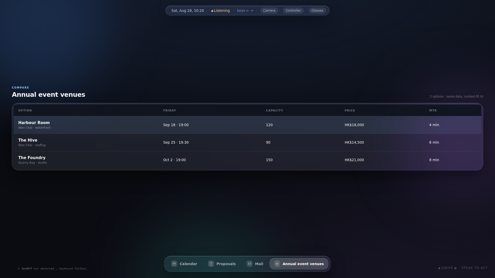 | 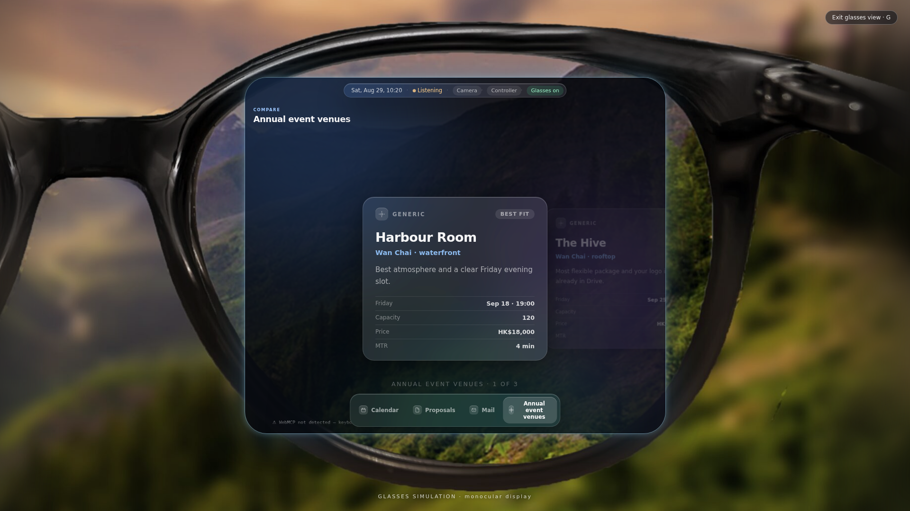 |

The glasses view is a real **glasses breakpoint**, not a scaled-down screen: the app gets a genuine near-square viewport carved into the lens, so the layout reflows and text stays readable — the way a phone breakpoint reflows a desktop page.


## Screens

| Mail deck | Single email (reader) |
| --- | --- |
|  |  |

| Calendar week | Calendar month | Drive files |
| --- | --- | --- |
|  |  |  |

| Proposed slots (agent-painted) | Invitation options (`choose`) | Recipients grid |
| --- | --- | --- |
| 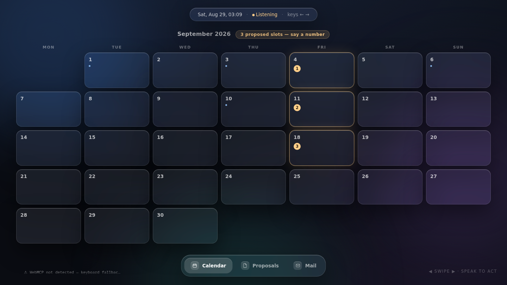 | 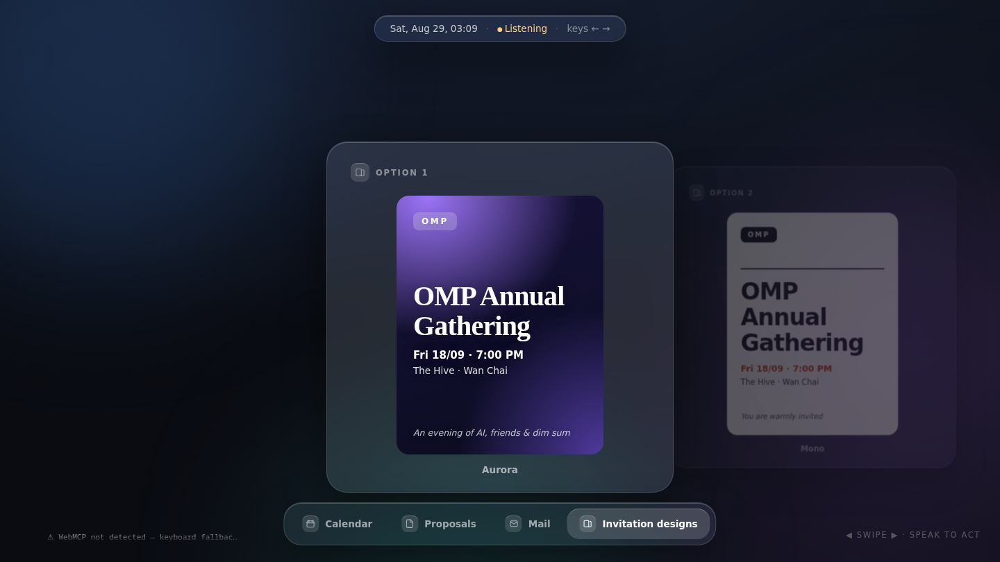 | 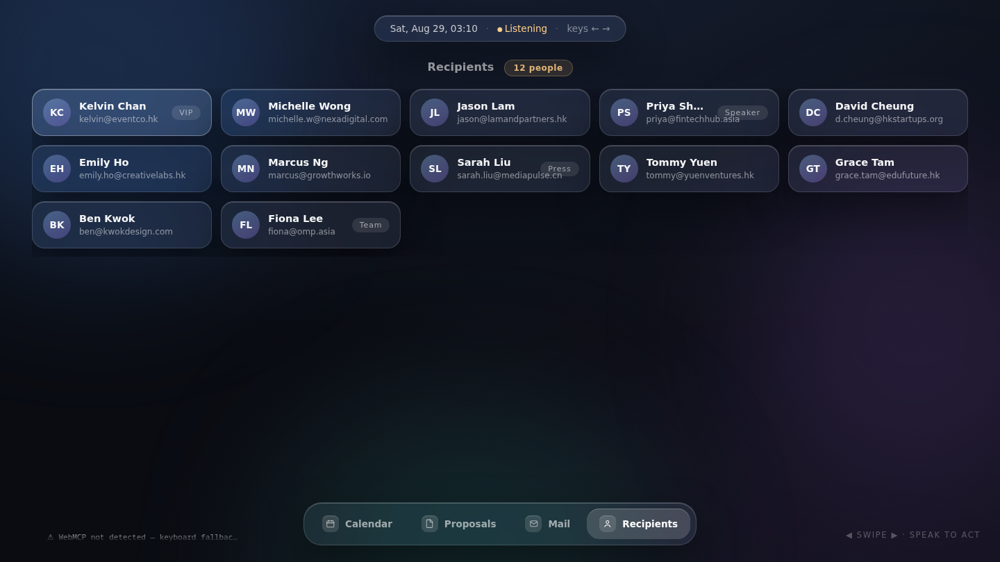 |

| Live map — pins + you-are-here | Ring D-pad on the dock |
| --- | --- |
| 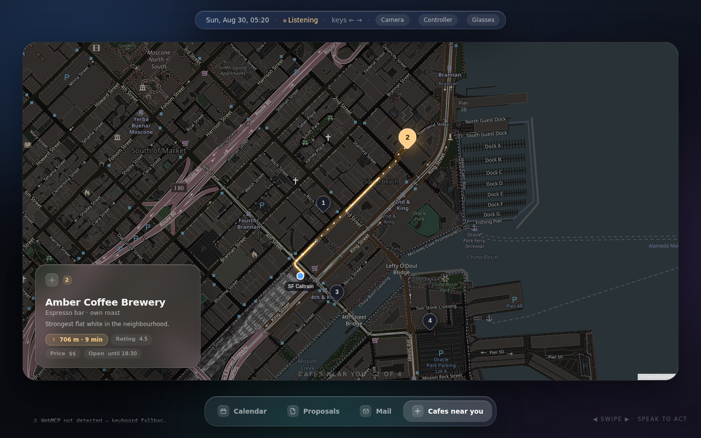 | 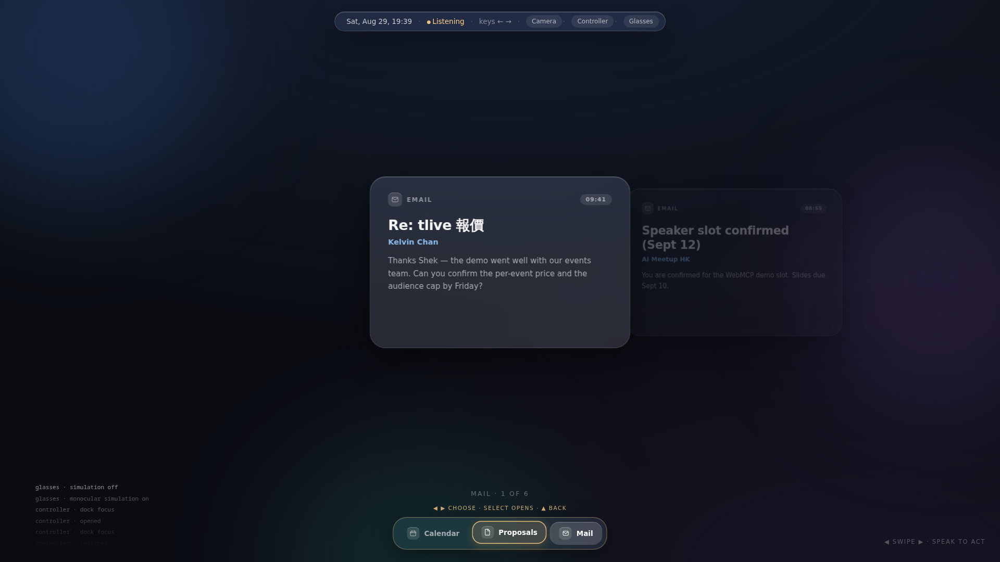 |

## The tool surface

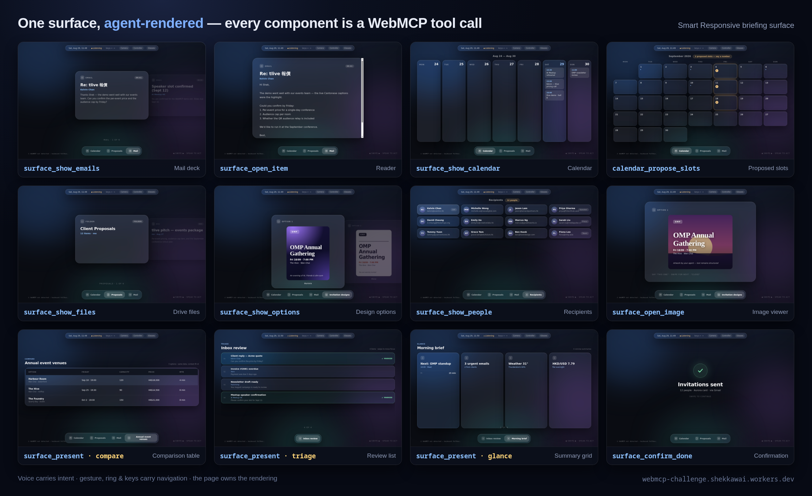

| Tool | Direction | Purpose |
| --- | --- | --- |
| `surface_present` | agent → page | **The smart-responsive contract**: render semantic data by purpose (`glance / browse / inspect / compare / choose / triage`), adapting desktop ↔ glasses and returning a render receipt |
| `surface_show_calendar` | agent → page | Render fetched events as a week/month view |
| `surface_show_emails` | agent → page | Render fetched emails as swipeable cards (pass `body` for full text) |
| `surface_show_files` | agent → page | Render a Drive folder listing as cards |
| `surface_show_items` | agent → page | Universal: render ANY collection as cards |
| `surface_select_item` | agent → page | Select from a `choose` presentation — *only while choices are shown* |
| `surface_toggle_item` | agent → page | Mark/unmark items in a `triage` presentation — *only during triage* |
| `surface_switch` | agent → page | Bring a rendered surface to the front |
| `surface_dismiss` | agent → page | Remove a surface from the dock ("close the mail panel") — *only while surfaces exist* |
| `map_set_location` | agent → page | Set the user's (told, not tracked) position — the map's blue you-are-here dot |
| `map_show_route` | agent → page | Draw + animate the walking route to a pin; returns distance, minutes, street names for the agent to speak — *only while a map is on screen* |
| `surface_open_item` | agent → page | Expand the focused card full-screen — *only while a deck is shown* |
| `surface_close_item` | agent → page | Close the reader — *only while the reader is open* |
| `surface_get_view_state` | page → agent | What the user is looking at (deixis: "this one") |
| `surface_speak` | agent → page | Speak through the surface's own speaker |
| `surface_set_calendar_view` | agent → page | Week/month toggle — *calendar only* |
| `calendar_propose_slots` | agent → page | Paint numbered proposed time slots onto the calendar — *calendar only* |
| `calendar_confirm_slot` | agent → page | Confirm a proposed slot; "Event added" is only claimed after the calendar connector confirms — *only while proposals exist* |
| `surface_show_options` | agent → page | Render 2–4 designed option cards with structured text and optional agent/Drive artwork |
| `option_select` | agent → page | Mark the chosen option — *only while options are shown* |
| `surface_show_people` | agent → page | Render recipients/contacts as a name-chip grid |
| `surface_confirm_done` | agent → page | Full-screen check confirmation after an action completes |
| `surface_open_image` | agent → page | Display an image from an HTTPS URL or `data:` URL (the Webroom ingestion pattern) |

## Input channels — pick by hardware

Not every pair of glasses has a camera, so WebHUD pairs a navigation input to whatever the hardware offers. The page is the same; only the way you swipe changes:

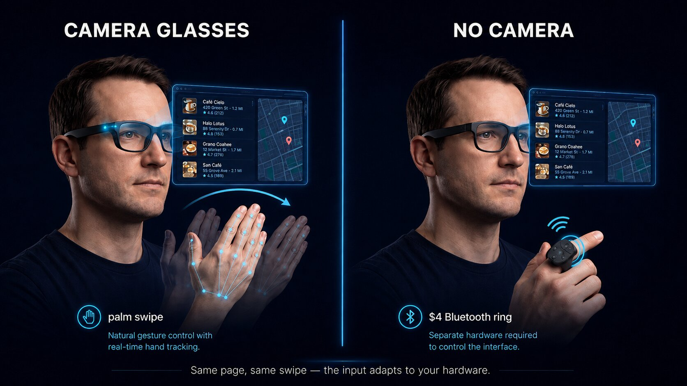

| Your hardware | Navigation | Why it fits |
| --- | --- | --- |
| Glasses / laptop **with a camera** | **Palm swipe** | Hands-free; MediaPipe tracking is local, camera pixels never leave the device |
| Display glasses **without a camera** | **$4 Bluetooth ring** | A clicker in your pocket — Previous / Next / Select becomes a full D-pad |
| Desktop, or nothing at hand | **Arrow keys** | ← → ↓ ↑ mirror the palm swipe and ring 1:1 |
| Phone or tablet | **Touch** | Drag a card sideways — the same one-verb swipe; the layout reflows to the glasses-lens breakpoint |
| Every context | **Voice, through the agent** | Carries *intent* ("show my week", "book slot 2") rather than navigation |

As implemented — real captures of both channels:

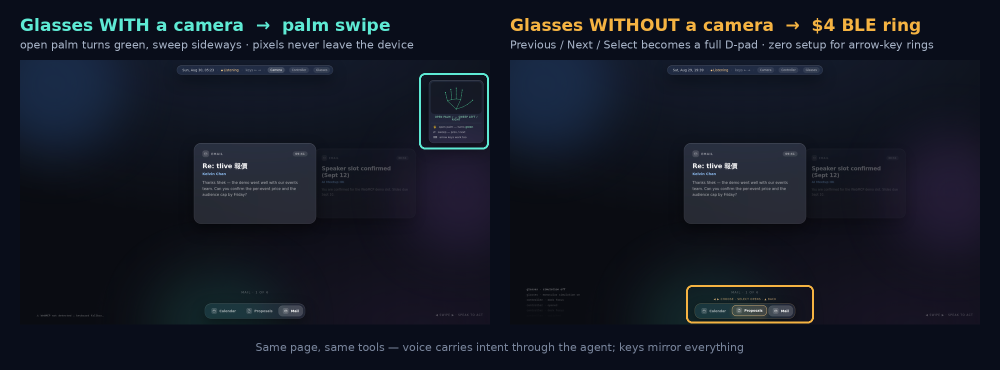

Voice carries **intent** (through the agent — seconds of round-trip are fine for decisions). Gesture, ring, and keys carry **navigation** (handled on-page, because navigation can't wait for a round trip). All channels stack; none is a mode.

### Camera palm-swipe

Click **Camera** in the top chip. The preview draws a live hand skeleton over the webcam feed — white = hand tracked, green = open palm recognized, sweep sideways to swipe. Tracking is local MediaPipe (vendored, offline-capable); frames never leave the tab. While the palm moves, the focused card follows it continuously and springs into place — an incomplete gesture springs back. Reduced-motion preferences disable direct manipulation and decorative transitions.

### Ring / clicker / wheel — the D-pad model

Navigation works like a game controller: **←/→** move focus, **↓** drops an amber highlight onto the dock, ←/→ move it between surfaces, **Select** opens the highlighted tab, **↑** returns to the cards. Inside an open document, ↓/↑ scroll it instead — reading beats navigating.

Click **Controller** and turn **Ring Mode** on — scroll rings work with zero setup: scroll down = Next, scroll up = Previous, Enter = Select. Rings that emit real arrow keys get the full D-pad the same way. If your device sends different signals, **Remap buttons** learns the exact key or wheel direction it emits and saves it locally. Select opens and chooses locally but never creates a calendar event or sends anything — those still require voice confirmation through the agent.

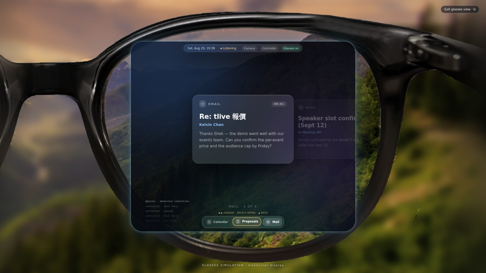

### Live map — the location shape

Items sent through `surface_present` that carry `lat`/`lng` render as numbered pins on a real map (Leaflet + OpenStreetMap, darkened to match the glass UI — no API key, no backend, lazy-loaded so the base page pays zero bytes until a map first renders). The agent is the data source ("find a cafe near me" → its own search → pins). `map_show_route` draws the real walking route with a draw-in + flowing-dash animation; a routing outage degrades to a dashed straight-line estimate, so the demo never stalls.

Try `?demo=cafes` and `?demo=route`. Swipe — palm, ring, or keys — moves pin to pin.

## Run locally

```bash
bun install
bun run test     # 98 tests: gesture landmarks, tool registration, intent contract, geometry
bun run dev
# open http://localhost:5173/?demo=mail   (← → mirror the palm swipe; G toggles glasses)
# window.__surface exposes the store, WebMCP adapter, and gesture controller
```

Deploy the production build to Cloudflare Workers with `bun run deploy`. Every push to `main` is tested and built by `.github/workflows/deploy.yml` (deploys when the `CLOUDFLARE_API_TOKEN` / `CLOUDFLARE_ACCOUNT_ID` secrets are present).

## What's inside

- WebMCP adapter over `document.modelContext.registerTool` with AbortSignal-owned dynamic registrations and the legacy `navigator.modelContext` fallback
- Six-purpose intent contract (`surface_present`) with adaptive renderers, render receipts, safe degradation, and a written proposal in [SPEC.md](SPEC.md)
- Typed views (mail / calendar / drive / people / options / images) plus the universal card system and dock
- Deixis via `surface_get_view_state` — position, focused item, dock highlight, visible week
- Camera palm-swipe with local MediaPipe, live skeleton overlay, and landmark-level tests (ported from [dsh-jarvis-hud](https://github.com/shekkawai/dsh-jarvis-hud), MIT)
- Learnable ring/clicker controller with the D-pad dock model and safe local Select
- Smart-glasses simulation: a true near-square lens breakpoint, pinned to the frame at any window size
- Live map with animated walking routes (Leaflet + OSM + OSRM, keyless)
- Unified motion system: palm-following cards, spring settling, directional transitions, reduced-motion support
- 98 tests + CI; deployed on Cloudflare Workers static assets

Early UI direction mockups live in `mockups/`.

## License

MIT — see [LICENSE](LICENSE). Third-party components are listed in [THIRD-PARTY-NOTICES.md](THIRD-PARTY-NOTICES.md).
