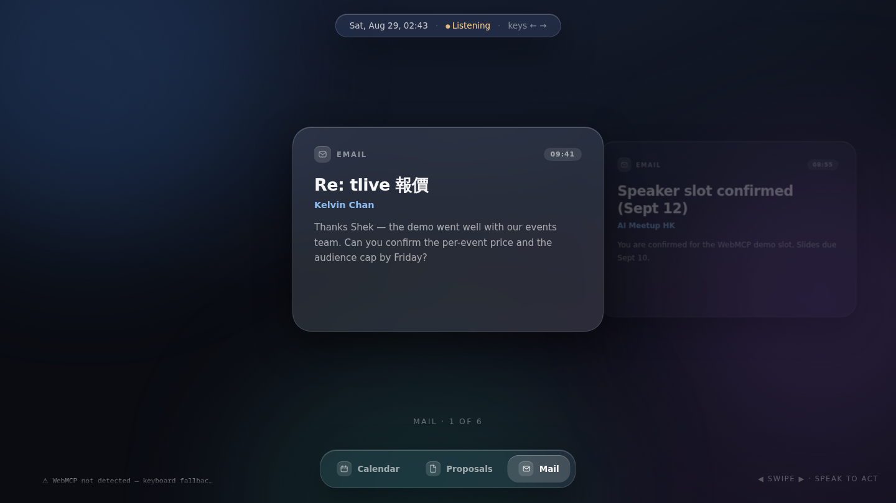
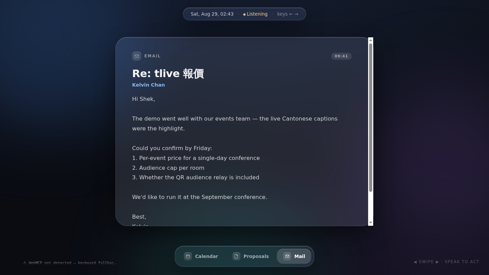
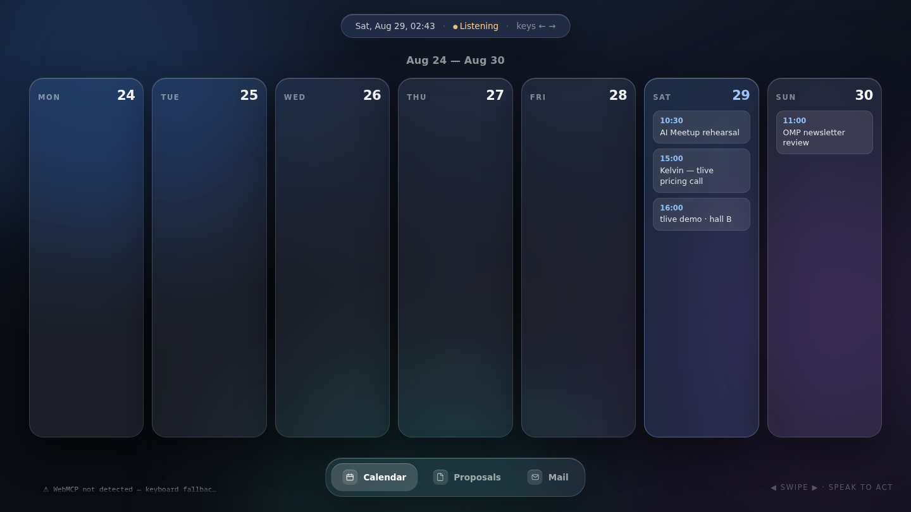
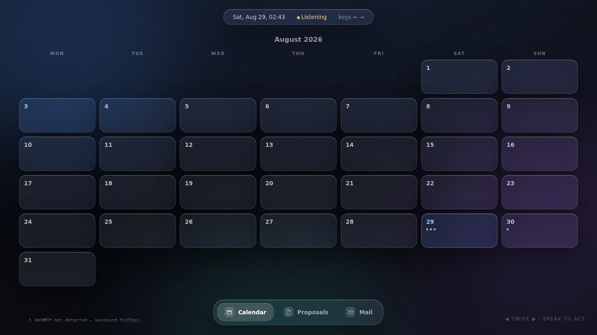
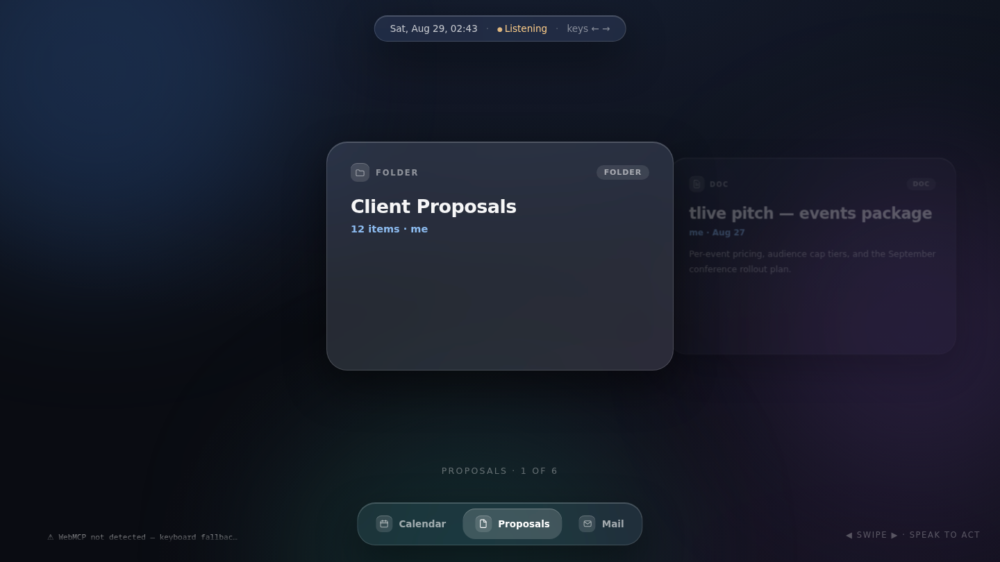
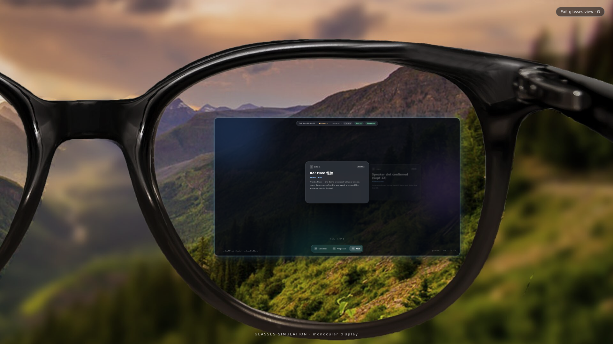

# WebMCPChallenge (working name)

**A universal, agent-rendered display surface.** Your agent (ChatGPT in its in-app browser, or any WebMCP-capable agent) pulls your real data through its own connectors — Gmail, Google Calendar, Google Drive, anything — and renders it onto a full-screen glass surface. You control it from two metres away:

- **Voice carries intent** — "show me next month", "open the tlive pitch doc", "reply: I'll confirm by Friday". Seconds of agent round-trip are fine for decisions.
- **A palm swipe carries navigation** — next email, next file, next week. Handled entirely on-page (camera → MediaPipe → swipe), because navigation can't wait for a round trip.
- **The swipe sets context the agent reads back** — `surface_get_view_state` tells the agent which card or week you are looking at, so "move *this* to Thursday" just works. Pointing with the whole screen.

Mail and Calendar get tailored views; everything else flows through one universal card system (`surface_show_items`) — the surface is an output device for agents the way a monitor is for programs.

Entry for the [OpenAI WebMCP Challenge](https://openai.com/webmcp-challenge/).

**Live demo:** <https://webmcp-challenge.shekkawai.workers.dev>

## Screens

| Mail deck | Single email (reader) |
| --- | --- |
|  |  |

| Calendar week | Calendar month | Drive files |
| --- | --- | --- |
|  |  |  |

## Why WebMCP

The agent's connectors know your data; the page knows your body and your focus. WebMCP is the only channel where those two meet: the page hands the agent a live, structured view of what a human is physically attending to — and tools appear/disappear (`toolchange`) as views change: the reader's `surface_close_item` only exists while the reader is open.

## Tools

| Tool | Direction | Purpose |
| --- | --- | --- |
| `surface_show_calendar` | agent → page | Render fetched events as a week/month view |
| `surface_show_emails` | agent → page | Render fetched emails as swipeable cards (pass `body` for full text) |
| `surface_show_files` | agent → page | Render a Drive folder listing as cards |
| `surface_show_items` | agent → page | **Universal**: render ANY collection as cards |
| `surface_switch` | agent → page | Bring a rendered surface to the front |
| `surface_open_item` | agent → page | Expand the focused card full-screen — *only while a deck is shown* |
| `surface_close_item` | agent → page | Close the reader — *only while the reader is open* |
| `surface_get_view_state` | page → agent | What the user is looking at (deixis: "this one") |
| `surface_speak` | agent → page | Speak through the surface's own speaker |
| `surface_set_calendar_view` | agent → page | Week/month toggle — *only while the calendar is on screen* |
| `calendar_propose_slots` | agent → page | Paint numbered proposed time slots onto the calendar — *calendar only* |
| `calendar_confirm_slot` | agent → page | Confirm a proposed slot; only claim “Event added” after the calendar connector confirms creation — *only while proposals exist* |
| `surface_show_options` | agent → page | Render 2–4 designed option cards with structured text and optional agent/Drive artwork |
| `option_select` | agent → page | Mark the chosen option — *only while options are shown* |
| `surface_show_people` | agent → page | Render recipients/contacts as a name-chip grid |
| `surface_confirm_done` | agent → page | Full-screen check confirmation after an action completes |
| `surface_open_image` | agent → page | Display an image from an HTTPS URL or `data:` URL (the Webroom ingestion pattern) |

## Run

```bash
bun install
bun run test
bun run dev
# open http://localhost:5173/?demo=mail
# (also: drive | calendar | month | reader | slots | options | chosen | people | done | photo)
# Click Camera to enable palm swipes; ← → remains the no-camera fallback
# Click Controller to teach a BLE ring/clicker its Previous, Next, and Select buttons
# Click Glasses (or press G, or add &glasses=1) for the smart-glasses
#   simulation — a POV shot through one lens, with the live surface pinned
#   inside the lens at any window size. Every input channel keeps working
#   underneath. Purely presentational.
# window.__surface exposes the store, WebMCP adapter, and gesture controller
```

### Glasses simulation (smart-responsive preview)

Responsive design adapted layout to screens; this surface adapts *interaction*
to context. The **Glasses** toggle shows what that means: the wearer's point
of view through one lens, with the same live page projected inside the lens as
a monocular AR display — driven by voice (through the agent) and a ring, with
no keyboard in reach. The panel is repositioned by JS as the window resizes so
it always stays on the glass (`LENS` in `src/views/glasses.ts` holds the lens
coordinates if the photo changes). Nothing about the page changes between
contexts; only the available input channels do.



### Testing the camera gesture

Click **Camera** in the top chip. The preview panel draws a live hand skeleton
over the webcam feed, so tracking is visible at a glance:

- **White skeleton** — your hand is tracked, but the pose isn't an open palm yet.
- **Green skeleton** — open palm recognized; a left/right sweep will fire.
- The status line narrates the same states (`raise a hand into view` →
  `hand tracked — open your palm` → `open palm ✓ — sweep left / right` →
  `swipe ✓ next`), and a gesture legend sits under the preview.

A swipe needs a deliberate sideways sweep (~15% of the frame width within
~0.3s). Slow drift and closed fists are ignored by design; after each swipe
there is a ~0.5s cooldown before the next one can fire.

### Ring / clicker / wheel input

Click **Controller**, then press the ring's **Previous**, **Next**, and
**Select** buttons once. The page learns the exact keyboard key, mouse button,
or wheel direction emitted by that device, saves it locally, and turns on Ring
Mode. Select opens the focused email/file or chooses the focused invitation
design; it never creates a calendar event or sends anything—those actions still
require voice confirmation through the agent.

Outside Ring Mode, vertical scrolling, PageUp/PageDown, ArrowUp/ArrowDown,
mouse clicks, and trackpad gestures keep their normal browser behavior. The
plain ArrowLeft/ArrowRight no-camera fallback remains available away from form
controls. Some media/browser keys can be consumed by the operating system and
will not reach any webpage; Controller Setup makes that limitation visible
instead of claiming universal compatibility.

Deploy the production build to Cloudflare Workers with `bun run deploy`.

Every pull request is automatically tested and built. Every push to `main` that passes those checks is deployed to Cloudflare Workers by `.github/workflows/deploy.yml`. The repository requires `CLOUDFLARE_ACCOUNT_ID` and a Worker-scoped `CLOUDFLARE_API_TOKEN` as GitHub Actions secrets.

## Status

- [x] WebMCP adapter (`document.modelContext`, AbortSignal-owned dynamic registrations; legacy fallback retained)
- [x] Universal stack/card model; Mail, Drive, and generic surfaces; calendar week + month
- [x] Reader mode (single email / doc full-screen), dock, deixis via `surface_get_view_state`
- [x] Glass UI (direction C: card deck, Apple-glass polish)
- [x] Event-planning flow: slot proposals → confirm-to-event, rendered invitation-card options, recipients grid, sent confirmation
- [x] Camera palm-swipe, local MediaPipe model, explicit camera control, and landmark-level tests (ported from [dsh-jarvis-hud](https://github.com/shekkawai/dsh-jarvis-hud), MIT)
- [x] Live hand-skeleton overlay on the camera preview, per-state status line, and on-screen gesture hints
- [x] Opt-in Controller Setup for BLE rings/clickers with learned Previous, Next, and safe local Select controls
- [x] Cloudflare Workers deployment with all camera assets verified over HTTPS
- [ ] Verify tool calls end-to-end in ChatGPT desktop in-app browser
- [ ] Demo video

Early UI direction mockups live in `mockups/`.

## License

MIT
