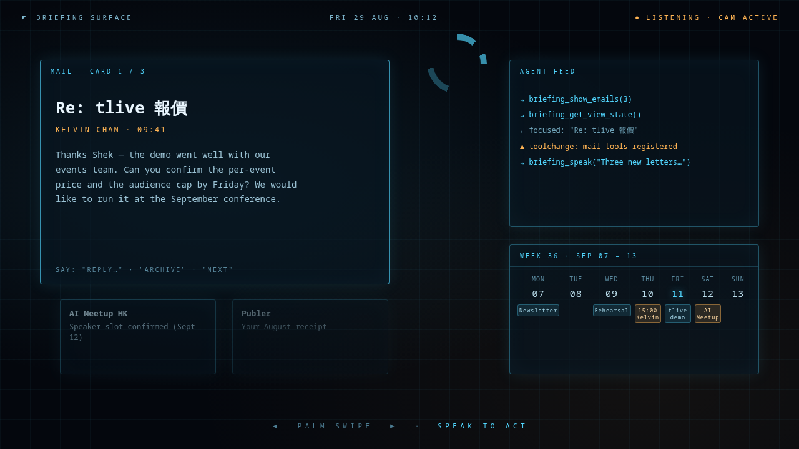
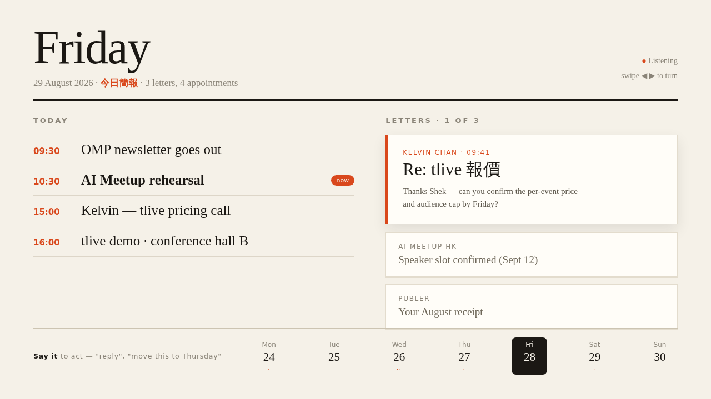
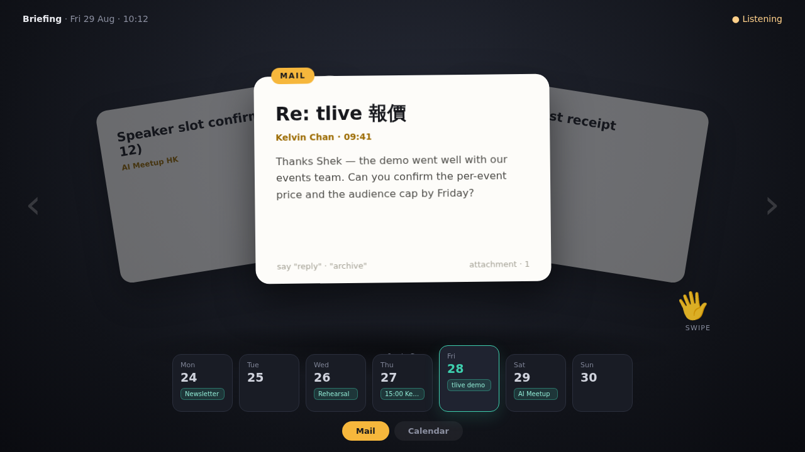

# WebMCPChallenge (working name)

**An agent-rendered briefing surface.** Your agent (ChatGPT in its in-app browser, or any WebMCP-capable agent) pulls your real calendar and mail through its own connectors and renders them onto a full-screen spatial surface. You control it from two metres away:

- **Voice carries intent** — "show me next month", "reply: I'll confirm the price by Friday". Seconds of agent round-trip are fine for decisions.
- **A palm swipe carries navigation** — next email, next week. Handled entirely on-page (camera → MediaPipe → swipe), because navigation can't wait for a round trip.
- **The swipe sets context the agent reads back** — `briefing_get_view_state` tells the agent which card or week you are looking at, so "move *this* to Thursday" just works. Pointing with the whole screen.

Entry for the [OpenAI WebMCP Challenge](https://openai.com/webmcp-challenge/).

## Why WebMCP

The agent's connectors know your data; the page knows your body and your focus. WebMCP is the only channel where those two meet: the page hands the agent a live, structured view of what a human is physically attending to — and tools appear/disappear (`toolchange`) as views change: mail tools only exist while mail is on screen.

## Tools

| Tool | Direction | Purpose |
| --- | --- | --- |
| `briefing_show_calendar` | agent → page | Render fetched events as a week/month view |
| `briefing_show_emails` | agent → page | Render fetched emails as swipeable cards |
| `briefing_get_view_state` | page → agent | What the user is looking at (deixis: "this one") |
| `briefing_speak` | agent → page | Speak through the surface's own speaker |
| `briefing_set_calendar_view` | agent → page | Week/month toggle — *only registered while calendar is on screen* |

## Run

```bash
bun install
bun run dev
# open http://localhost:5173/?demo=1  (demo seeds fake mail; ← → keys mirror the palm swipe)
```

`window.__briefing` exposes the store and adapter for debugging.

## UI direction mockups

| A — HUD | B — Calm broadsheet | C — Card deck |
| --- | --- | --- |
|  |  |  |

## Status

- [x] WebMCP adapter (`document.modelContext` / `navigator.modelContext`, dynamic tool sets)
- [x] State store with swipe semantics + `get_view_state` deixis contract
- [x] Neutral renderer (calendar week/month, mail deck), keyboard swipe fallback
- [ ] Pick UI direction, reskin
- [ ] Camera palm-swipe (port from [dsh-jarvis-hud](https://github.com/shekkawai/dsh-jarvis-hud), MIT)
- [ ] Verify tool calls end-to-end in ChatGPT desktop in-app browser
- [ ] Demo video

## License

MIT
